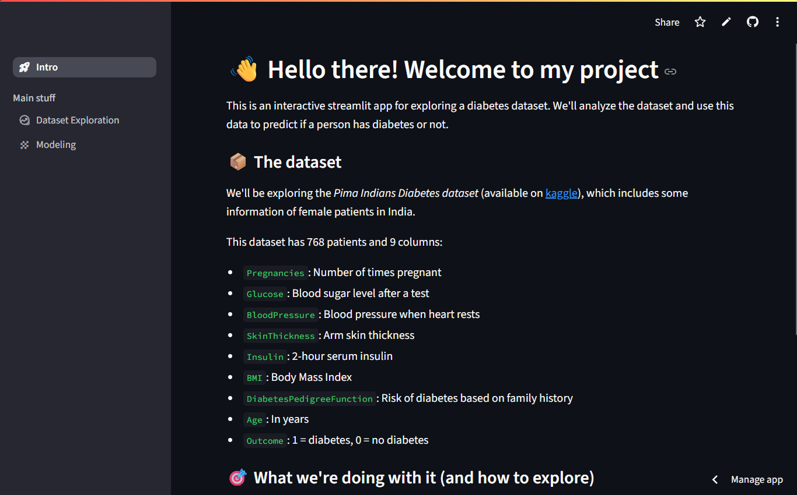
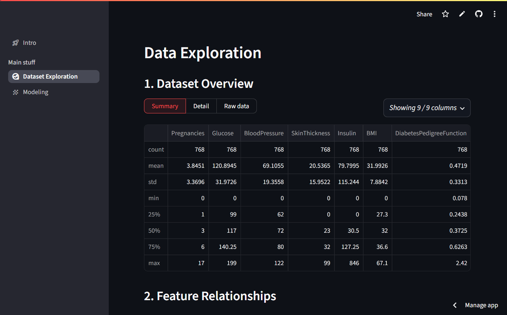
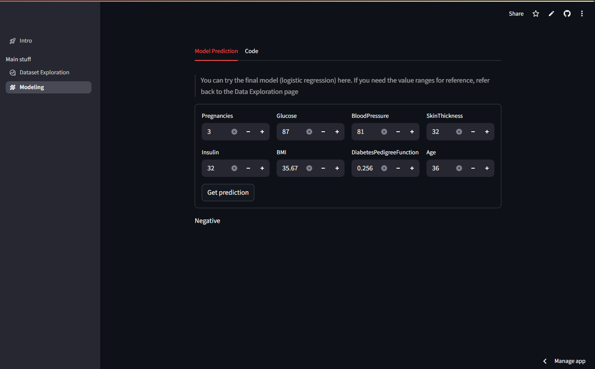
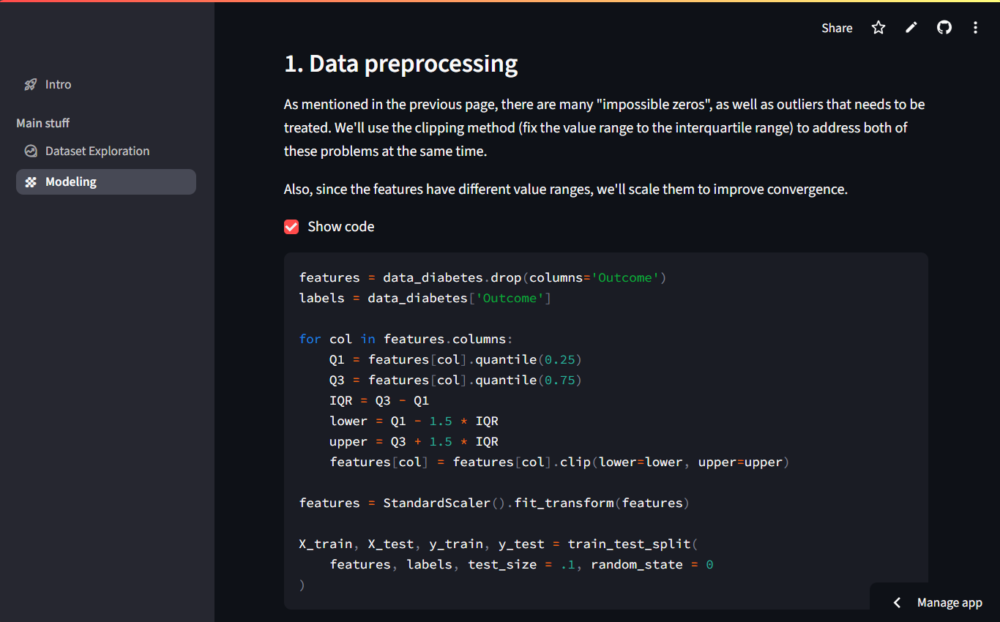

# AI01 Capstone Project: Diabetes Prediction Web App


## 🫧 Overview
This project is a Streamlit-based web application for interacting with the Pima Indians Diabetes Dataset. The app allows users to explore the dataset, understand relationships between features, and test predictions using different models.  

Deployed App: [Click here to try it out](https://ai01-capstone-quang-bk85f8nm8fonqyquqnenh4.streamlit.app/)

## ⭐ Features in each page
- Dataset Exploration
  - View dataset overview, summary statistics, and single-feature visualizations.
  - Check correlations and scatter plots between features.
  - Read initial observations from the dataset.
- Modeling
  - Compare models (Logistic Regression, KNN) using cross-validation.
  - View model configurations and performance metrics.
  - Predict diabetes likelihood by entering patient data.

## 📦 Dataset
Source: Pima Indians Diabetes Database, available on [kaggle](https://www.kaggle.com/datasets/mathchi/diabetes-data-set)  
Attributes: Pregnancies, Glucose, BloodPressure, SkinThickness, Insulin, BMI, DiabetesPedigreeFunction, Age  
Target: Outcome - diabetes (1), non-diabetes (0).

## 🛠️ Installation
1. Clone the repository
```
git clone https://github.com/QuangHD4/AI01_Capstone__Streamlit_App_for_Diabetes_Dataset.git
cd https://github.com/QuangHD4/AI01_Capstone__Streamlit_App_for_Diabetes_Dataset.git
```
2. Create and activate a virtual environment

&emsp;&emsp;```python -m venv venv```

&emsp;&emsp;Windows:  
&emsp;&emsp;&emsp; ```.venv\Scripts\Activate.ps1``` (powershell)  
&emsp;&emsp;&emsp; ```.venv\Scripts\activate``` (command prompt)  

&emsp;&emsp;macOS/Linux:  ```source .venv/bin/activate```  

3. Install dependencies

&emsp;&emsp; ```pip install -r requirements.txt```  

4. Run the Streamlit app
 
&emsp;&emsp; ```streamlit run main.py```

## 📂 Project Structure
```
project-folder/
|-- main.py               # Main Streamlit app file
|-- requirements.txt      # Dependencies
|-- models/               # Trained models & related data
|-- data/                 # Dataset
|-- scripts/              # Standalone scripts to train the models
|-- src/                  # Helper scripts (data processing & modeling)
|-- README.md             # Project doc
```

## 🎥 Demo

### **1. Home page**

*Overview of the app with navigation menu for Dataset Exploration and Modeling.*  

---

### **2. Dataset Overview**  
  
*Displays summary statistics for quick understanding of the data.*  

---

### **3. Charts**  
  
*Pairwise scatter plot for showing correlations between health metrics.*  

---

### **4. Modeling Tab - Predictions**  
  
*Input patient details and get a prediction on the likelihood of diabetes.*  

---

### **5. Model training process**  
  
*Data preprocessing step before training the models*  
