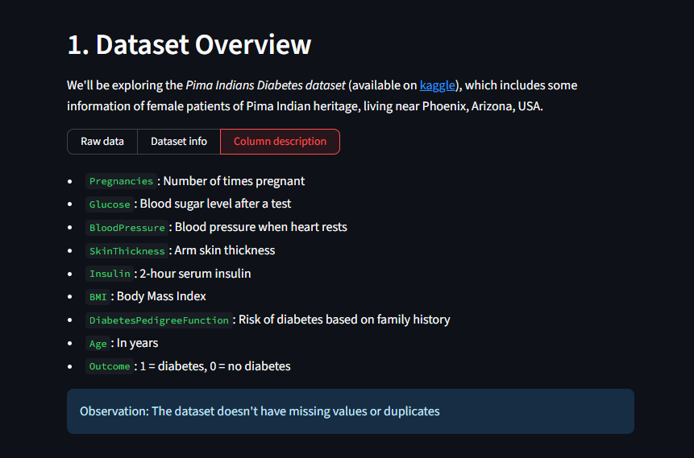
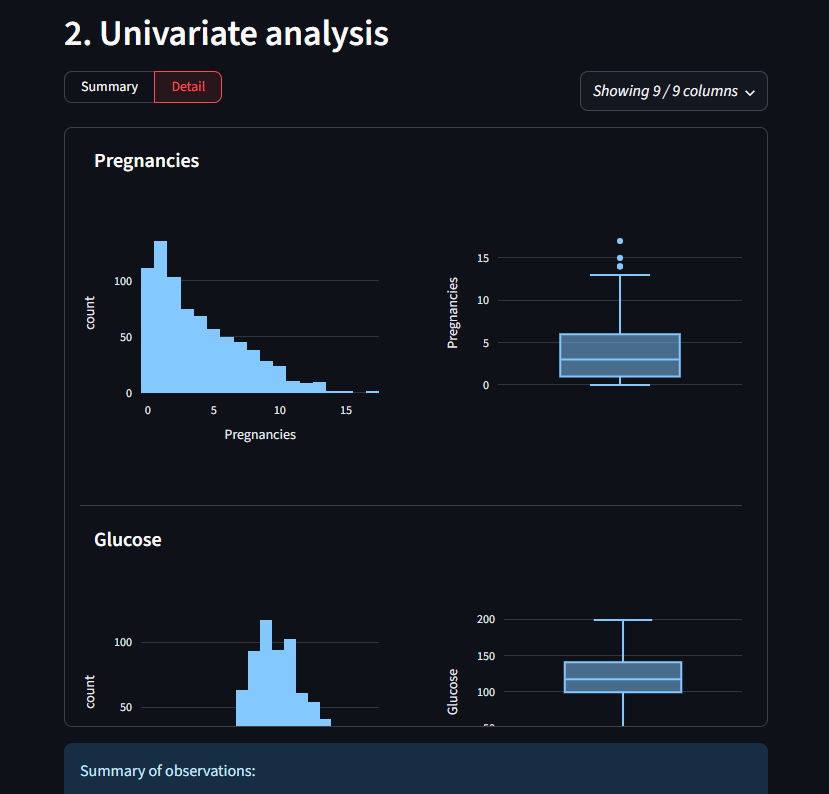
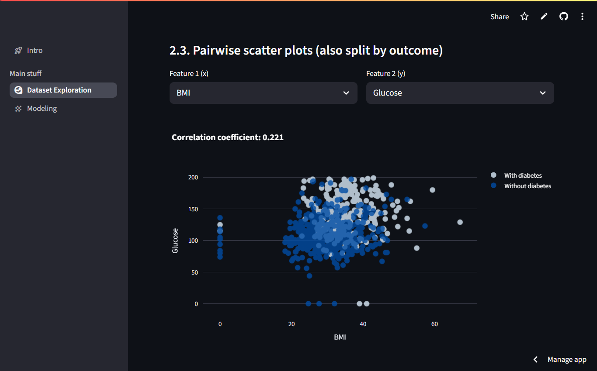
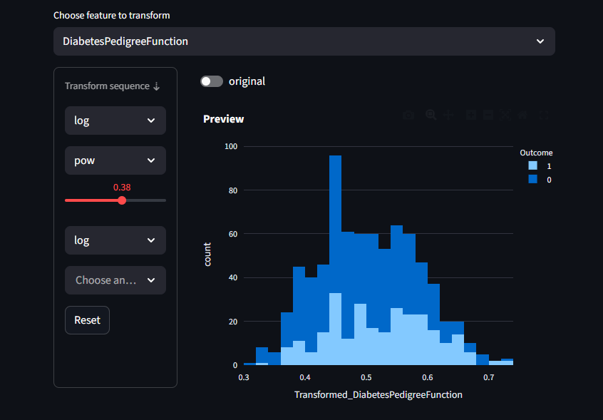

# AI01 Capstone Project: Diabetes Data Analysis Web App


## 🫧 Overview
This project is a Streamlit-based web application for interacting with the Pima Indians Diabetes Dataset. The app aims to help users get a general sense of a data analysis project by walking them through each stage of a data analysis project.  

Deployed App: [Click here to try it out](https://ai01-capstone-quang-bk85f8nm8fonqyquqnenh4.streamlit.app/)

## ⭐ Features in each page
- Dataset Overview
  - Basic info of the dataset
  - Initial data quality observations
- Univariate Analysis
  - Single-column charts
  - Observations on suspicious values and feature distribution
- Bivariate Analysis
  - More charts
  - More observations (feature interactions) 
- Playground
  - Various imputers for missing values
  - Distribution transformers
  - Feature creator
  - A few more interactive charts

## 📦 Dataset
Source: Pima Indians Diabetes Database, available on [kaggle](https://www.kaggle.com/datasets/mathchi/diabetes-data-set)  
Attributes: Pregnancies, Glucose, BloodPressure, SkinThickness, Insulin, BMI, DiabetesPedigreeFunction, Age  
Target: Outcome - diabetes (1), non-diabetes (0).

## 🛠️ Installation
1. Clone the repository
```
git clone https://github.com/QuangHD4/AI01_Capstone__Streamlit_App_for_Diabetes_Dataset.git
cd https://github.com/QuangHD4/AI01_Capstone__Streamlit_App_for_Diabetes_Dataset.git
```
2. Create and activate a virtual environment

&emsp;&emsp;```python -m venv venv```

&emsp;&emsp;Windows:  
&emsp;&emsp;&emsp; ```.venv\Scripts\Activate.ps1``` (powershell)  
&emsp;&emsp;&emsp; ```.venv\Scripts\activate``` (command prompt)  

&emsp;&emsp;macOS/Linux:  ```source .venv/bin/activate```  

3. Install dependencies

&emsp;&emsp; ```pip install -r requirements.txt```  

4. Run the Streamlit app
 
&emsp;&emsp; ```streamlit run main.py```

## 📂 Project Structure
```
project-folder/
|-- main.py               # Main Streamlit app file
|-- requirements.txt      # Dependencies
|-- pages/                # Pages for the main app
|   |-- overview.py
|   |-- univariate.py
|   |-- bivariate.py 
|   |-- playground.py  
|-- src/                  # Helper scripts (custom app elements and errors)
|-- README.md             # Project doc
```

## 🎥 Demo

### **1. Dataset Overview**

*Overview of the dataset*  

---

### **2. Univariate Analysis**  
  
*Displays histograms for quick understanding of the feature's distribution.*  

---

### **3. Bivariate Analysis**  
  
*Pairwise scatter plot for showing correlations between health metrics.*  

---

### **4. Playground**  
  
*Make a feature normal using transformations*  
